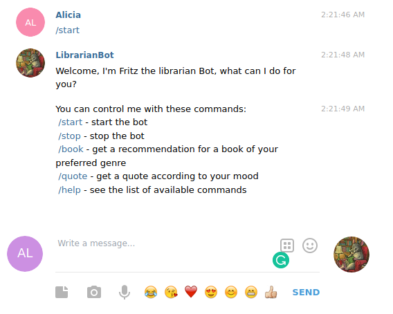
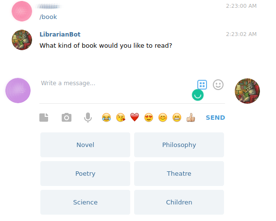

# Ruby Capstone Project
## Fritz The Librarian Bot

> A Telegram Bot that recommends books of a chosen genre and sends random quotes according to the user's mood.

### Why a librarian bot?
> Nowadays, many people would rather look at memes on instagram than take the time to sit down and enjoy a good read.
Perhaps in a few years, human librarians will no longer exist, as everything will be fully automated. 
As a friendly reminder for children and adults, the librarian bot is the ideal synthesis between modern technologies and old habits that should not be lost.

## Demo Video

Watch a video demo [HERE](https://www.loom.com/share/cde0216e533b4a53b41d1427ac62b0f9)

## Built With

- Ruby
- telegram-bot-ruby gem
- Telegram's BotFather
- RSpec

## Getting Started

To get a local copy up and running follow these simple steps.

### Prerequisites

- Terminal
- Ruby [Install](https://www.theodinproject.com/courses/ruby-programming/lessons/installing-ruby-ruby-programming)
- RSpec [Install](https://www.theodinproject.com/courses/ruby-programming/lessons/introduction-to-rspec)
- An account on [Telegram](https://telegram.org/). You can use either the mobile or desktop app.

### Install

#### Clone the repository
- Click on the "code" button above in this page and copy the link of the repository
- Open a terminal (CTRL + ALT + T), type `git clone` and paste the link you copied in the previous step, then hit Enter
- Go to the cloned repository using `cd` command

#### Setup
- Run `bundle install` to install the required gems in your computer
- From within the directory of the project, type `fritz` to run the exectuable file and hit Enter

#### Add the token to your local repository
- Open a terminal and from within the cloned repository, type `touch .token.yml`
- Using the text editor of your choice, paste the following content inside the created file:
`telegram_bot_token: 1421884274:AAE20q-0ohSKN8h2PNYOblp3C8CLYTXzwzA`

### Usage

- Go to the Telegram app and search for fritz_librarian_bot
- Click on the Start button or type `/start` to initialize the bot.
- Type `/book` to get a recommendation of a book. You can choose from the genres listed: Novel, Philosophy, Poetry, Theatre, Science or Children
- Type `/quote` to get a random quote according to your mood
- Type `/help` to see the list of available commands
- Use CTRL + C in your terminal to stop the bot 

### Run tests

From the root folder, run `rspec` to run the tests

## Authors

👤 **Alicia Paz Rojas**

- GitHub: [@aliciapaz](https://github.com/aliciapaz)
- Twitter: [@_alicia_paz](https://twitter.com/_alicia_paz)
- LinkedIn: [Alicia Rojas](https://www.linkedin.com/in/alicia-rojas-71468418a/)

## 🤝 Contributing

Contributions, issues, and feature requests are welcome!

Feel free to check the [issues page](https://github.com/aliciapaz/ruby_bot/issues).

## Show your support

Give a ⭐️ if you like this project!

## Acknowledgments

- [Telegram Bot API](https://github.com/atipugin/telegram-bot-ruby)
- [Boilerplate for Telegram bots](https://github.com/MaximAbramchuck/ruby-telegram-bot-starter-kit)

## 📝 License

This project is [MIT](LICENSE) licensed.
